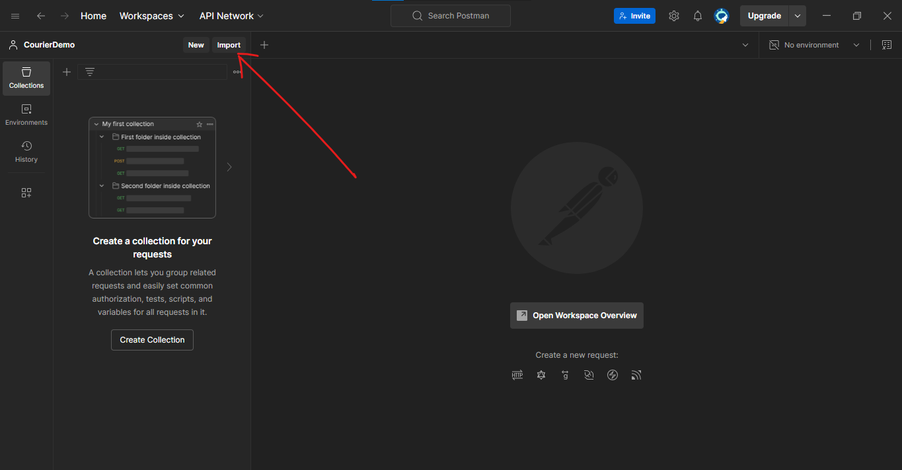

# Blog API Project

A RESTful API built with Laravel for managing user posts with user authentication.

## Features

-   User Authentication (Register/Login)
-   Post Management (CRUD operations)
-   Token-based Authentication using Sanctum
-   Input Validation
-   JSON Responses

## Prerequisites

-   PHP >= 8.1
-   Composer
-   Git

## Local Setup

1. Clone the repository:

```bash
git clone https://github.com/di-void/alumunite-assessment.git
cd alumunite-assessment
```

2. Install dependencies:

```bash
composer install
```

3. Configure environment:

```bash
cp .env.example .env
php artisan key:generate
```

4. Run migrations:

```bash
php artisan migrate
```

5. Start the development server:

```bash
php artisan serve
```

## API Endpoints

### Authentication

#### Register

-   **POST** `/api/v1/register`
-   Body: `name`, `email`, `password`

#### Login

-   **POST** `/api/v1/login`
-   Body: `email`, `password`

#### Logout

-   **POST** `/api/v1/logout`
-   Requires: Authentication Token

### Posts

#### Get All Posts

-   **GET** `/api/v1/posts`
-   Requires: Authentication Token

#### Create Post

-   **POST** `/api/v1/posts`
-   Requires: Authentication Token
-   Body: `title`, `content`

#### Get Single Post

-   **GET** `/api/v1/posts/{id}`
-   Requires: Authentication Token

#### Update Post

-   **PUT** `/api/v1/posts/{id}`
-   Requires: Authentication Token
-   Body: `title`, `content`

#### Delete Post

-   **DELETE** `/api/v1/posts/{id}`
-   Requires: Authentication Token

## Running the Application

1. Start the development server

    ```bash
    php artisan serve
    ```

    This will start the application on [http://127.0.0.1:8000](http://127.0.0.1:8000)

2. API Testing (with Postman)
    - Import the Postman collection from your Postman app
      

## Error Handling

The API returns appropriate HTTP status codes and error messages in JSON format:

-   200: Success
-   201: Created
-   404: Not Found
-   422: Validation Error
-   500: Server Error

## Security

-   Password hashing
-   Token-based authentication
-   Input validation
-   Protected routes
